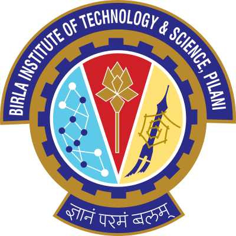

#  

<h1 align="center">
CSF111 - Introduction to Computer Programming
</h1>

  <a href="https://drive.google.com/file/d/1EzvfQ0XRc1b71rMDpbHXK6kgkSXHpzw7/view?usp=sharing">Course Handout</a> | <a href="https://drive.google.com/drive/folders/1nJlpP9zI90u0imY9kPIJKlyZVfs2cdlL?usp=sharing">PSet Link</a>

## Works

<pre align="center">
For Reference Only :
</pre>

 This is a repository to encapsulate everything covered in BITS Pilani's Intro to Computer Programming course. By the end of this semester, this repo will have been updated with notes from all lectures, as well as resources for lab work, practice assignments, and past papers.

 If you want to collaborate, just open a PR and add onto the notes taken. Please try to be as concise as possible.

 Kindly keep in mind about the academic honesty and plagarism as per course policy. 

